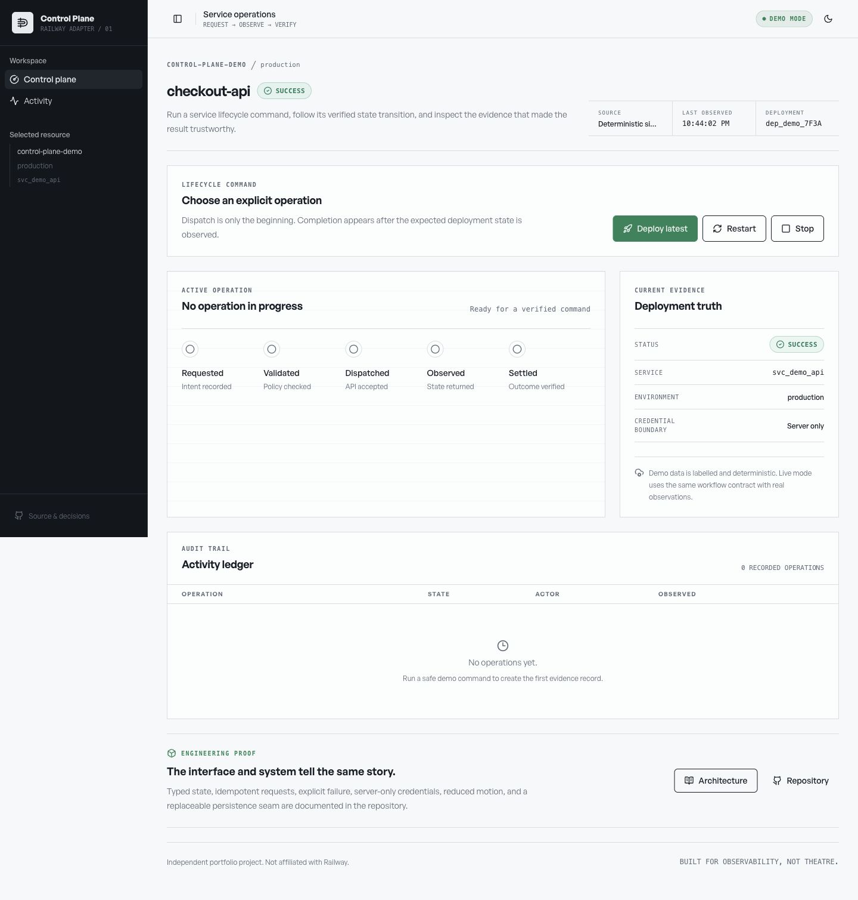

<div align="center">

# Railway Control Plane

**A safe service lifecycle UI that turns opaque cloud commands into verified, auditable workflows.**

[](https://github.com/yigiterturk-dev/railway-control-plane/actions/workflows/ci.yml)


</div>



## Why this exists

Infrastructure dashboards often collapse a slow, failure-prone operation into a spinner and a premature success toast. This project takes the opposite approach: deploy, restart, and stop actions travel through explicit server-owned states—`requested`, `validated`, `dispatched`, `observed`, and `settled`—and become successful only when the expected deployment state is observed.

It is an independent portfolio project built around Railway's public GraphQL API. It is not affiliated with Railway and does not copy Railway's interface or visual identity.

## What reviewers can verify

- Run the entire product in deterministic demo mode without credentials or external side effects.
- Deploy, restart, stop, and start a simulated service from the same UI used by live mode.
- Inspect actor, timestamp, severity, idempotency key, state changes, sanitized evidence, and final disposition in the activity ledger.
- Switch to a real Railway project through a server-only adapter—no API token is sent to the browser.
- Review explicit failure/timeout states, active-operation locking, target-context validation, and live destructive-action confirmation.
- Read the architectural trade-offs, threat model, decision record, design research, motion contract, and implementation ledger in the repository.

## Architecture at a glance

```text
React + TanStack Query
        │
        ▼
Express workflow API ─── idempotency + target validation + event ledger
        │
        ├── DemoControlPlane (deterministic, no side effects)
        │
        └── RailwayControlPlane (GraphQL v2, server-only token)
                          │
                          ▼
                observed deployment status
                          │
                          ▼
                   settled / failed
```

The adapter boundary is intentionally small:

```ts
interface ControlPlaneAdapter {
  readonly mode: "demo" | "live";
  getContext(): Promise<ResourceContext>;
  dispatch(input: ActionRequest): Promise<DispatchResult>;
  observe(deploymentId: string): Promise<ObserveResult>;
}
```

See [architecture](docs/architecture.md), [threat model](docs/threat-model.md), and [ADR 0001](docs/decisions/0001-adapter-boundary.md).

## Run locally

Requirements: Node.js 20 or newer.

```bash
git clone https://github.com/yigiterturk-dev/railway-control-plane.git
cd railway-control-plane
npm install
cp .env.example .env
npm run dev
```

Open `http://localhost:5000`. `CONTROL_PLANE_MODE` defaults to `demo`; no account or secret is required.

## Connect a Railway service

Create a server-side `.env` from [.env.example](.env.example), set `CONTROL_PLANE_MODE=live`, and provide the approved project, environment, and service IDs. Account/workspace tokens use `Authorization: Bearer`; project tokens use `Project-Access-Token`. The adapter selects the correct header from `RAILWAY_TOKEN_TYPE`.

```dotenv
CONTROL_PLANE_MODE=live
RAILWAY_API_TOKEN=
RAILWAY_TOKEN_TYPE=account
RAILWAY_PROJECT_ID=...
RAILWAY_ENVIRONMENT_ID=...
RAILWAY_SERVICE_ID=...
```

Never prefix secrets with `VITE_`. The client bundle has no credential path.

## Verification

```bash
npm run check      # strict TypeScript
npm test           # lifecycle, idempotency, target validation
npm run build      # Vite client + bundled Express server
npm audit --omit=dev
```

Current verified results:

- Typecheck: pass
- Workflow tests: 3/3 pass
- Production build: pass
- Client bundle: 107.57 KB gzip
- Production dependency audit: 0 vulnerabilities
- Browser QA: 1440×900 and 390×844, no horizontal overflow or console errors
- Interactive QA: restart → stop → start, each settled from observed state

CI runs the complete `npm run verify` pipeline on pull requests and `main`.

## Reliability decisions

| Concern | Implemented now | Production evolution |
|---|---|---|
| Duplicate requests | Idempotency key + one-active-run guard | Postgres unique constraint + distributed lock |
| False success | Expected Railway status must be observed | Webhook reconciliation + monotonic event versions |
| Secret exposure | Server-only environment variable | Managed secret store and rotation |
| Arbitrary targeting | Request IDs must match server-approved context | Authenticated per-user authorization policy |
| Slow upstream | 10s request timeout + explicit verification timeout | Queue, retry policy, circuit breaker |
| Persistence | Typed in-memory adapter + Drizzle schema | Postgres implementation of `IStorage` |

The repository deliberately does **not** claim multi-tenancy, production RBAC, distributed workflow guarantees, or live Railway verification before those are actually implemented and tested.

## Repository map

```text
client/src/components/control-plane/  Original operator UI primitives
server/control-plane.ts               Demo + Railway GraphQL adapters
server/routes.ts                      Workflow orchestration and HTTP API
server/storage.ts                     Replaceable workflow/event storage
shared/schema.ts                      Zod contracts + Drizzle models
docs/                                 Architecture, threat model, decisions
.nocturn/                              Research-to-build design audit trail
```

## Design rationale

The visual system is an “operational ledger,” not a generic metrics dashboard. One signal green is reserved for healthy/actionable state. The signature rail never advances beyond server evidence, and reduced-motion users receive immediate textual state updates without loops or transform animation.

Reference research transfers only abstract communication principles. No reference assets, code, branded UI, animation timings, or compositions were copied. The evidence limits and Similarity Guard are documented in [.nocturn/01-reference-dossier.md](.nocturn/01-reference-dossier.md) and [.nocturn/02-art-direction.md](.nocturn/02-art-direction.md).

## Deployment

The repository includes [railway.json](railway.json) with build, start, restart, and healthcheck configuration. Deployment remains a separate approval step so a live account or billable resource is never connected implicitly.

## License

[MIT](LICENSE) © 2026 Yigit Erturk
